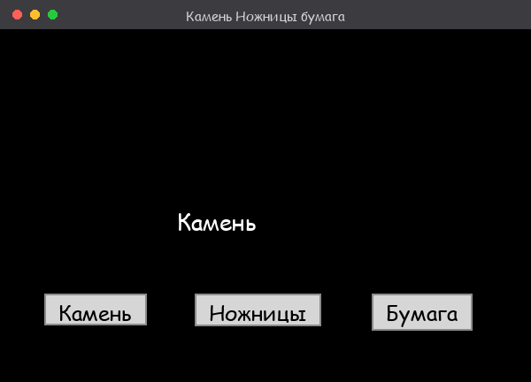

# ✊✌️✋ Rock, Scissors, Paper · Камень, Ножницы, Бумага

**🇬🇧 [English](#english) · 🇷🇺 [Русский](#русский)**

<p align="center">
  
</p>

---

## English

A simple desktop GUI game in Python with **Tkinter**. Press any button — the program randomly picks one of the three options and shows the result on screen.

### 🚀 Run
```bash
python game.py
```
Tkinter ships with the Python standard library, so nothing extra needs to be installed.

### 🔑 Key technical highlights

**1. GUI on Tkinter with zero dependencies.** The whole interface is built from standard widgets: a `Tk()` window, a `Label` and three `Button`s. No third-party libraries.

**2. Fixed size and `place` positioning.** The window is non-resizable and elements are placed at exact coordinates:
```python
root.resizable(width=False, height=False)
rock.place(x=50, y=300)
```
`.place(x, y)` gives full control over layout — buttons always sit exactly where intended.

**3. Random choice via `random.choice`.** The game logic is one function: pick a random option from a list and put it into the label text.
```python
def rock_scissors_paper():
    rsp = ['Камень', 'Ножницы', 'Бумага']
    value = choice(rsp)
    lable_text.configure(text=value)
```

**4. One handler for all buttons.** All three buttons call the same `command` — no duplication, a single point of logic.

**5. Real-time UI update.** The result isn't printed to the console but changes right in the window via `configure(text=...)`.

### 🛠️ Tech
**Python 3** · **Tkinter** (GUI) · **random**

### 💡 Possible improvements
- Add a player choice and compare it with the computer's (who wins)
- Track wins and losses
- Highlight the result with colour

---

## Русский

Простая desktop-игра с графическим интерфейсом на Python и **Tkinter**. Нажимаешь любую кнопку — программа случайно выбирает один из трёх вариантов и показывает результат на экране.

### 🚀 Запуск
```bash
python game.py
```
Tkinter входит в стандартную библиотеку Python, дополнительно ничего ставить не нужно.

### 🔑 Ключевые технические решения

**1. GUI на Tkinter без зависимостей.** Весь интерфейс — стандартные виджеты: окно `Tk()`, метка `Label` и три кнопки `Button`. Ни одной сторонней библиотеки.

**2. Фиксированный размер и позиционирование через `place`.** Окно нерастягиваемое, элементы расставлены по точным координатам:
```python
root.resizable(width=False, height=False)
rock.place(x=50, y=300)
```
`.place(x, y)` даёт полный контроль над расположением — кнопки всегда там, где задумано.

**3. Случайный выбор через `random.choice`.** Логика игры — одна функция: из списка случайно берётся вариант и подставляется в текст метки.
```python
def rock_scissors_paper():
    rsp = ['Камень', 'Ножницы', 'Бумага']
    value = choice(rsp)
    lable_text.configure(text=value)
```

**4. Одна функция-обработчик на все кнопки.** Все три кнопки вызывают один `command` — без дублирования, единая точка логики.

**5. Обновление интерфейса в реальном времени.** Результат не печатается в консоль, а меняется прямо в окне через `configure(text=...)`.

### 🛠️ Технологии
**Python 3** · **Tkinter** (GUI) · **random**

### 💡 Возможные улучшения
- Добавить выбор игрока и сравнение с выбором компьютера (кто победил)
- Вести счёт побед и поражений
- Подсветка результата цветом

---
*Учебный проект для знакомства с Tkinter и обработкой событий. / Educational project for getting started with Tkinter and event handling.*
